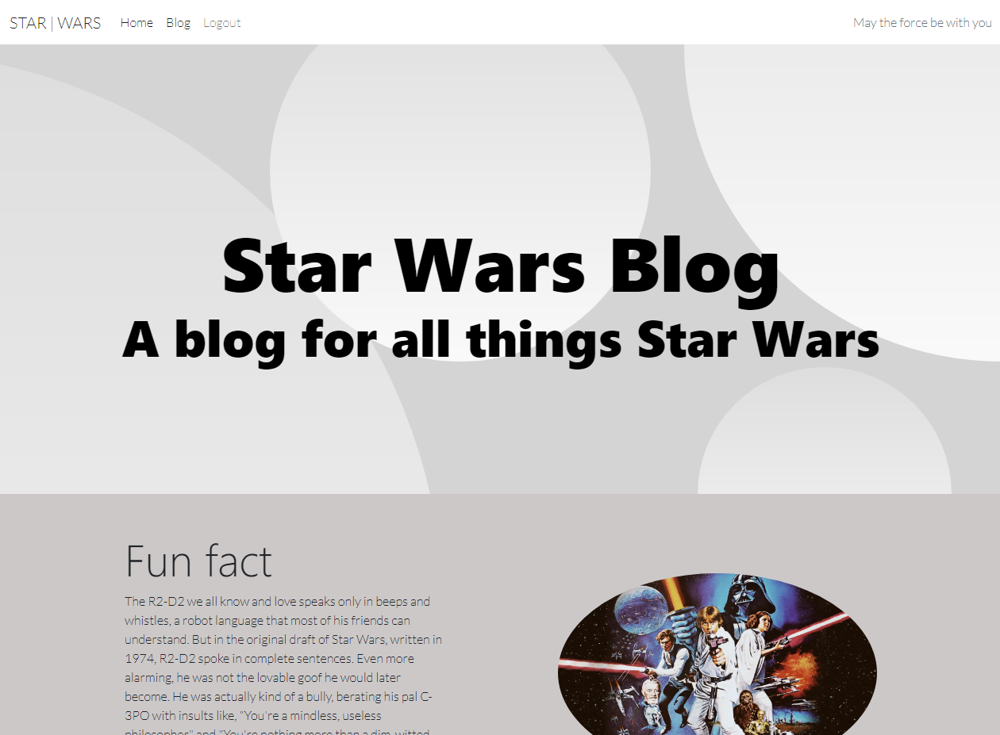
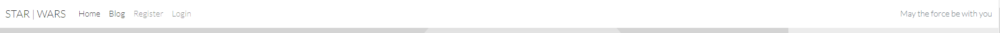
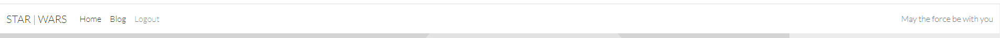
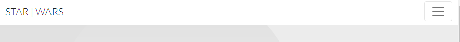
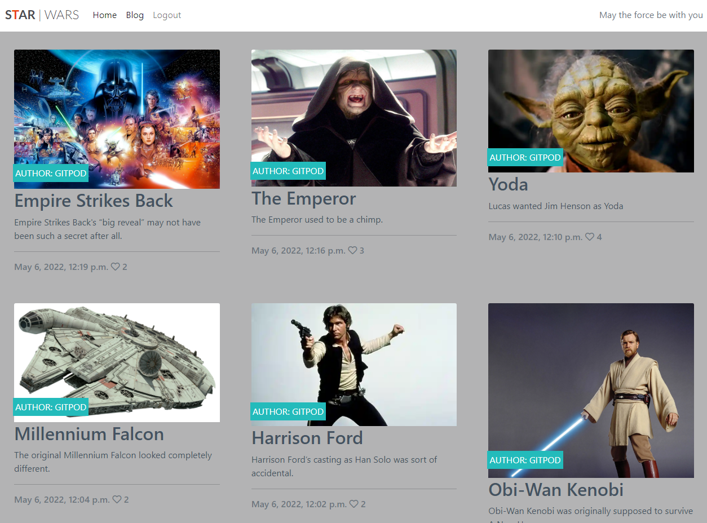
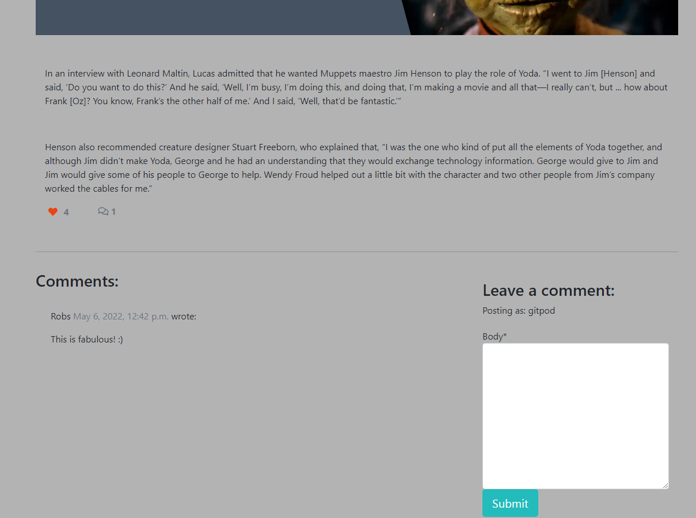
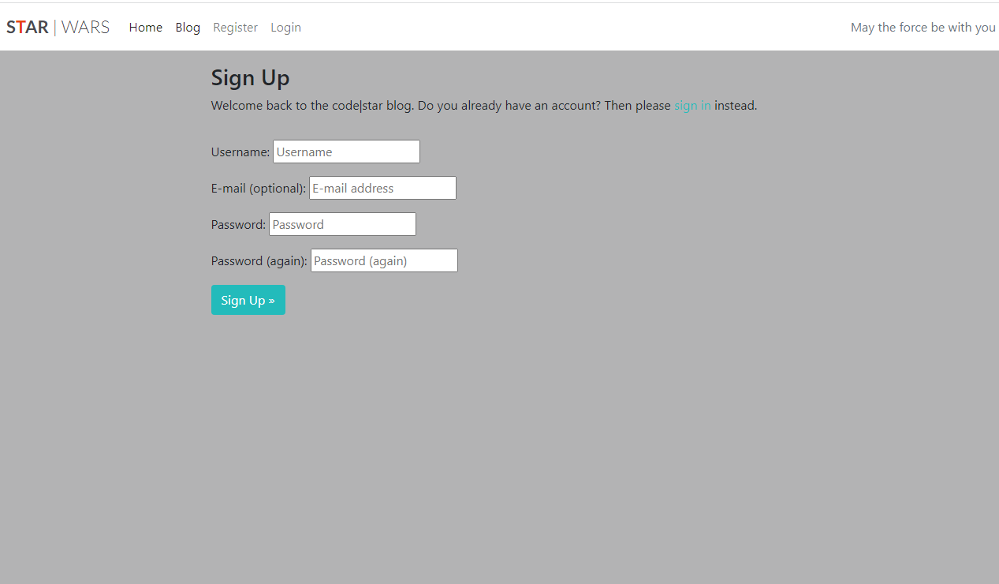
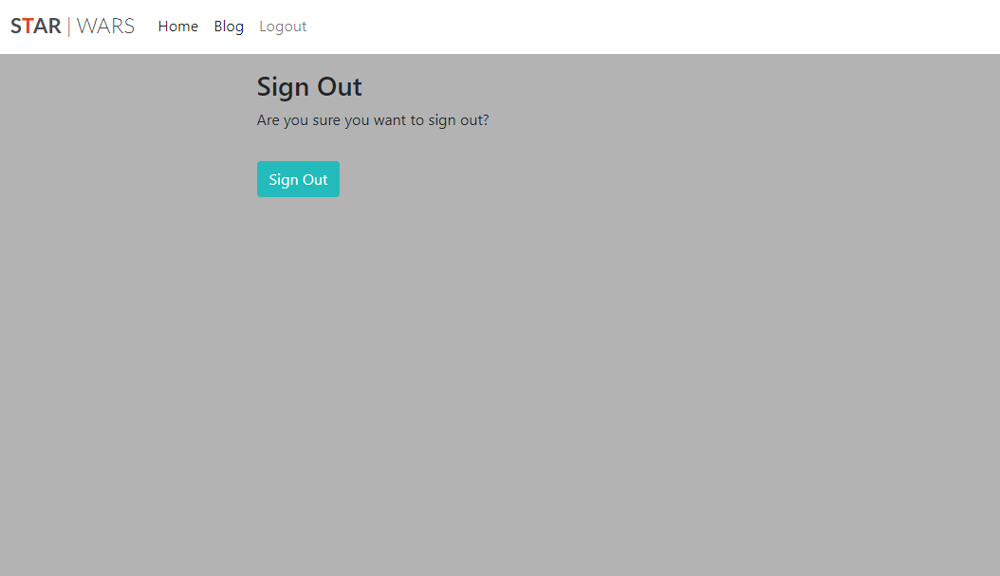

<h1 align="center">Star Wars Blog</h1>

[View the live project here](https://star-wars-alan.herokuapp.com/)

The Star wars Blog contains an application is a website / blog that gives details on Star Wars.

General users can view details on the blog which is their landing page. However users can also register with the website and sign in this brings them to the landing homepage unregistered users are brought to the main blog page. - Once a user is signed in this allows them to then comment on and like the information provded.

The admin user of the site can add new blog info, approve general user comments and assign different roles to user who register.

## Index – Table of Contents
* [User Experience (UX)](#user-experience-ux) 
* [Features](#features)
* [Design](#design)
* [Planning](#planning)
* [Technologies Used](#technologies-used)
* [Testing](#testing)
* [Deployment](#deployment)
* [Credits](#credits)

## User Experience (UX)

### User stories :

* View a post: As a Site User I can view a list of posts so that I can select one to read.
* Open a post: As a Site User I can click on a post so that I can read the full text.
* View likes: As a Site User / Admin I can view the number of likes on each post so that I can see which is the most popular or viral.
* View comments: As a Site User / Admin I can view comments on an individual post so that I can read the conversation.
* Site pagination: As a site user I can view a paginated list of posts, so that the benefit is I can select which post I want to view.
* Account registration: As a Site User I can register an account so that I can comment and like.
* Comment on a post: As a Site User I can leave comments on a post so that I can be involved in the conversation.
* Like / Unlike: As a Site User I can like or unlike a post so that I can interact with the content.
* Manage a post: As a Site Admin I can create, read, update and delete posts so that I can manage my blog content.
* Create drafts: As a Site Admin I can create draft posts so that I can finish writing the content later.
* Approve comments: As a Site Admin I can approve or disapprove comments so that I can filter out objectionable comments.
* View landing page: As a Site User I can view a landing page so that I can see what the blog is about.

## Features

### Existing Features

-   __Navigation Bar__
    
    The navigation bar has a consistent look and placement each page supporting easy and intuitive navigation.  It includes a Logo, and a link to the Home page. If the user is not signed in then links are available to the Register and Sign in pages.  If a user is signed in then the links available, in addition to the Home link, Blog and Sign out.
    
    If the user signed in as the admin user they need to place /admin at end of url.  This link takes the user to the Django Admin screens where data in the underlying database can be added, retrieved, modified and deleted.
    
    The navigation bar is responsive on multiple screen sizes - on smaller screens it coverts to a 'burger' menu style.  
    
    
    
    

-   __Landing page image and text__
    
    At the top of the landing page (home page) there is an area that includes a design and a text overlay which together clearly identify the purpose of the site as a blog for all things Star Wars.

    

-   __Blog Post__
    
    On the Blog page a list of posts are shown.  Each post gives an image, a title, details on the post, number of likes. At a glance the user can decide quickly if this is a post that might appeal to them.  To keep the page uncluttered, summaries are limited to a maximum of 6 per page, with pagination available when more than 6 posts exist.
    
    

-   __Post Detail Page__
    
    When a user clicks on a post summary title on the blog page they are brought to the Post Detail page for the clicked post.  Here the user is shown a full description of the post, information on when the post details were created and last edited, the number of likes, number of comments and they can read all of the comments approved for the post which are listed in order most recent first.  Only users who are signed in can comment on a post or 'like' a post.  

    

-   __Comment on post__
    
    In order to comment on a post a user must be signed in.  A comment can be added on any Post Detail page.  The user enters their comment in a text box under the post and clicks on Submit.  The comment must be approved by the admin user before it will be visible on the Hike Detail page.  
    
    To approve comments the admin user logs in to the admin pages, opens the Comments table, selects the comment(s) to be approved, chooses the 'Approve Comments' action from the drop-down menu and clicks 'Go'.  Alternatively, they can be approved one at a time by clicking on the comment row to open it, updating the value in the approved field and saving the update.
    
    All comments approved for a post are shown on that post's Post Detail page in the order of newest first.

    

    -   __Like a post__
    In order to like a post a user must be signed in.  A post can be liked on its Post Detail page. The user simply needs to click on the like/heart icon to toggle between like/unlike.

    

-   __User authentication__
    
    The application provides the following user authentication related functions :

    - User Registration
      - A user needs to be registered before they can sign in.  The option to Register appears on the navigation bar when no user is currently signed in.  To Register, the user needs to provide a) a username which has not already been registered, b) an optional email address (if this is provided then it needs to be an email address that is not already registered) and c) a password which they must enter twice.  Once registered a user can sign in.

        

    - User Sign in
      - Once registered a user can sign in and will have access to extra functionality, namely :
        - can comment on a post
        - can like a post
        - can book and cancel hikes

      - To sign in the user must provide a) a registered username and b) the password for the username
     
        
      
    - User Sign out
      - A signed in user can sign out by clicking on the Sign out link on the navigation bar.  The user simply needs to confirm the action by clicking on the Sign out button on the page.

        

-   __Add and Publish a Post__
    
    The admin user adds and publishes post using the admin pages.  The admin user can access these pages either by appending '/admin' to the application url or by signing in to the application and clicking on the Admin link that appears on the navigation bar only when admin is signed in.

    To add a new post, the admin user can use the "+ Add" link to the right of the post table name and then fill in the data fields for the post.  Post titles must be unique and a slug will be automatically generated as the title is typed in.   A rich editor (summernote) is made available for the post description content field so that formatting can be easily added. A default image will be used for the post if the admin user does not upload one.  Posts can be saved with a status of Draft (default) and will not be visible to general users until this status is updated to Published - this allows the admin to save a post and finish it later.

   -   __On-screen messages__
    
    To enhance usability of the application, user messages appear on-screen to confirm when certain actions have happened or report on problems.  For successful operations, a message will appear at the top of the screen and then fade-out/slide-up after few seconds.  For problems logging in, messages will appear in red text on-screen and stay until a user attempts the operation again.

-   __How these features support the user stories__
    
    The User Stories in the [User Experience (UX)](#user-experience-ux) part of this document are numbered 1 to 9. Below is a traceability matrix cross-referencing the user stories with the features, illustrating which features support which stories :
        

## Design

-   ### Template

    I used the 2 templates to design the site, first one was from the Django plug in this was for all pages excluding the landing page for the landing page I used (https://startbootstrap.com/theme/one-page-wonder)

## Planning

A GitHub Project with linked Issues was used as the Agile tool for this project.  User Stories with acceptance criteria were defined using GitHub Issues and development of code for these stories was managed using a Kanban board.  All of the User Stories were linked to a 'parent' Epic issue to show how they all supported the over-arching goal of the project.  The acceptance criteria were tested as each story moved to 'Done'.

## Technologies Used

### Languages Used

-   [HTML5](https://en.wikipedia.org/wiki/HTML5)
-   [CSS3](https://en.wikipedia.org/wiki/Cascading_Style_Sheets)
-   [Python](https://www.python.org/)

### Frameworks, Libraries & Programs Used

-   [Google Fonts:](https://fonts.google.com/) used for the Lato font
-   [Font Awesome:](https://fontawesome.com/) was used to add icons for aesthetic and UX purposes.
-   [Git:](https://git-scm.com/) was used for version control by utilising the Gitpod terminal to commit to Git and Push to GitHub.
-   [GitHub:](https://github.com/) is used as the respository for the project code after being pushed from Git. In addition, for this project GitHub was used for the agile development aspect through the use of User Stories (GitHub Issues) and tracking them on a Kanban board.
-   [dbdiagram.io](https://dbdiagram.io/home) was used to create the Entity Relationship diagrams for the application data model
-   [Django](https://www.djangoproject.com/) was used as the framework to support rapid and secure development of the application
-   [Bootstrap](https://getbootstrap.com/) was used to build responsive web pages
-   [Gunicorn](https://gunicorn.org/) was used as the Web Server to run Django on Heroku
-   [dj_database_url](https://pypi.org/project/dj-database-url/) library used to allow database urls to connect to the postgres db
-   [psycopg2](https://pypi.org/project/psycopg2/) database adapter used to support the connection to the postgres db
-   [Cloudinary](https://cloudinary.com/) used to store the images used by the application
-   [Summernote](https://pypi.org/project/django-summernote/) used to provide WYSIWYG editing on the Hike editing screen
-   [Django allauth](https://django-allauth.readthedocs.io/en/latest/index.html) used for account registration and authentication
-   [Django crispy forms](https://django-crispy-forms.readthedocs.io/en/latest/) used to simplify form rendering
-   [Django testing tools](https://docs.djangoproject.com/en/3.2/topics/testing/tools/) used for python mvt testing

## Testing

* To check the site was working I used manual testing and sent app out to friends who all logged in succesfully on different devices and were able to login and read, navigate, comment and like the posts.
* After compeleting each task in the user stories I checked on serveral devices to see if the site was working and what I expected to happen as a user happened. This lead to changes having to me made to ensure it worked as I expected.
* As I used the templates from "I think therefore I Blog" not automated testing was required.

### Validator Testing 

- [HTML Validator]()

    - As this project uses Django templates the html has been validated by manually clicking through the application pages, copying the source of the rendered pages and then validating this version of the html using the W3C Validator (link shown above).  HTML for the Django admin site pages was not edited so has not been validated here.

   
- [CSS Validator](https://jigsaw.w3.org/css-validator/)

   
- [Python Validator](http://pep8online.com/)

  

### Browser Compatibility

- Chrome DevTools was used to test the responsiveness of the application on different screen sizes.  In addition, testing has been carried out on the following browsers :
    - Google Chrome version 9.0.4606.81 (64-bit)
    - Firefox version 93.0 (64-bit)
    - Microsoft Edge 94.0.992.38 (64-bit)
  

### Known bugs

- Currently no known bugs.

## Deployment

Detailed below are instructions on how to clone this project repository and the steps to configure and deploy the application.  Code Institute also provides a summary of similar process steps here : [CI Cheat Sheet](https://codeinstitute.s3.amazonaws.com/fst/Django%20Blog%20Cheat%20Sheet%20v1.pdf)

1. How to Clone the Repository
2. Create Application and Postgres DB on Heroku
3. Configure Cloudinary to host images used by the application
4. Connect the Heroku app to the GitHub repository
5. Executing automated tests
6. Final Deployment steps

### How to Clone the Repository 

- Go to the https://github.com/alanwhelan1978/star-wars-blog repository on GitHub 
- Click the "Code" button to the right of the screen, click HTTPs and copy the link there
- Open a GitBash terminal and navigate to the directory where you want to locate the clone
- On the command line, type "git clone" then paste in the copied url and press the Enter key to begin the clone process
- To install the packages required by the application use the command : pip install -r requirements.txt
- When developing and running the application locally set DEBUG=True in the settings.py file
- Changes made to the local clone can be pushed back to the repository using the following commands :

  - git add *filenames*  (or "." to add all changed files)
  - git commit -m *"text message describing changes"*
  - git push

- N.B. Any changes pushed to the master branch will take effect on the live project once the application is re-deployed from Heroku

### Create Application and Postgres DB on Heroku
- Log in to Heroku at https://heroku.com - create an account if needed.
- From the Heroku dashboard, click the Create new app button.  For a new account an icon will be visible on screen to allow you to Create an app, otherwise a link to this function is located under the New dropdown menu at the top right of the screen.
- On the Create New App page, enter a unique name for the application and select region.  Then click Create app.
- On the Application Configuration page for the new app, click on the Resources tab.
- In the Add-ons search bar enter "Postgres" and select "Heroku Postgres" from the list - click the "Submit Order Form" button on the pop-up dialog.
- Next, click on Settings on the Application Configuration page and click on the "Reveal Config Vars" button - check the DATABASE_URL has been automatically set up. 
- Add a new Config Var called DISABLE_COLLECTSTATIC and assign it a value of 1.
- Add a new Config Var called SECRET_KEY and assign it a value - any random string of letters, digits and symbols.
- The settings.py file should be updated to use the DATABASE_URL and SECRET_KEY environment variable values as follows :

  - DATABASES = {'default': dj_database_url.parse(os.environ.get('DATABASE_URL'))}

  - SECRET_KEY = os.environ.get('SECRET_KEY')

- In Gitpod, in the project terminal window, to initialize the data model in the postgres database, run the command : python3 manage.py migrate 
- Make sure the project requirements.txt file is up to date with all necessary supporting files by entering the command : pip3 freeze --local > requirements.txt
- Commit and push any local changes to GitHub.
- In order to be able to run the application on localhost, add SECRECT_KEY and DATABASE_URL and their values to env.py

### Configure Cloudinary to host images used by the application
- Log in to Cloudinary - create an account if needed.  To create the account provide your name, email and set up a password.  For "primary interest" you can choose "Programmable Media for image and video API".  Click "Create Account" and you will be sent an email to verify your account and bring you to the dashboard.
- From the dashboard, copy the "API Environment variable" value by clicking on the "Copy to clipboard" link.
- Log in to Heroku and go to the Application Configuration page for the application.  Click on Settings and click on the "Reveal Config Vars" button.
- Add a new Config Var called CLOUDINARY_URL and assign it the value copied from the Cloudinary dashboard, but remove the "CLOUDINARY_URL=" at the beginning of the string. 
- In order to be able to run the application on localhost, also add the CLOUDINARY_URL environment variable and value to env.py

### Connect the Heroku app to the GitHub repository
- Go to the Application Configuration page for the application on Heroku and click on the Deploy tab.
- Select GitHub as the Deployment Method and if prompted, confirm that you want to connect to GitHub. Enter the name of the github repository (the one used for this project is (https://github.com/alanwhelan1978/star-wars-blog) and click on Connect to link up the Heroku app to the GitHub repository code.
- Scroll down the page and choose to either Automatically Deploy each time changes are pushed to GitHub, or Manually deploy - for this project Manual Deploy was selected.
- The application can be run from the Application Configuration page by clicking on the Open App button.
- The live link for this project is (https://star-wars-alan.herokuapp.com/)

### Final Deployment steps
Once code changes have been completed and tested on localhost, the application can be prepared for Heroku deployment as follows :
- Set DEBUG flag to False in settings.py
- Ensure this line exists in settings.py to make summernote work on the deployed environment (CORS security feature): X_FRAME_OPTIONS = 'SAMEORIGIN'
- Ensure requirements.txt is up to date using the command : pip3 freeze --local > requirements.txt
- Push files to GitHub
- In the Heroku Config Vars for the application delete this environment variable :  DISABLE_COLLECTSTATIC
- On the Heroku dashboard go to the Deploy tab for the application and click on deploy branch

#### The live link to the application can be found here - [P4 STAR WARS BLOG](https://star-wars-alan.herokuapp.com/) 

## Credits 

### Code 
- Much of the coding and testing relies heavily on information in the "Hello Django" and "I Think Therefore I Blog" walkthroughs in the Code Institue Full Stack Frameworks module. 

### Content 
- Information on the blog was found on various star wars fan websites

### Media 
- The Lato font used was imported from [Google Fonts](https://fonts.google.com/)
- Fontawesome was used for icons, including icons for like, comments, user - [Font Awesome](https://fontawesome.com/)
  
### Acknowledgments

- Thank you to my mentor Brian Macharia for his continuing help and feedback. His advice and tips have been very beneficial, especially in the area of coding standards and best practice.